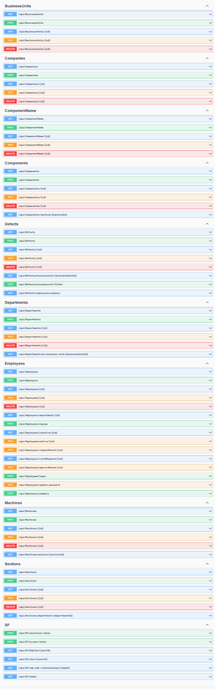

# Machine Defects Management System - Backend API

A comprehensive .NET 8.0 Web API application for managing and tracking machine defects in industrial environments with hierarchical organizational structure support.

## Technologies

- **.NET 8.0** - Primary framework
- **ASP.NET Core Web API** - RESTful API architecture
- **Entity Framework Core 8.0** - ORM with Code-First migrations
- **MySQL** - Database with Pomelo MySQL provider
- **Swagger/OpenAPI** - API documentation and testing

## Key Features

### Organizational Hierarchy
- Multi-level structure: Company → Business Units → Departments → Sections → Machines → Components
- Complete organizational tree management

### Defect Management
- Full defect lifecycle tracking (creation to resolution)
- Status and priority monitoring
- Employee assignment and role management
- Image attachment support for defect documentation

### API Capabilities
- RESTful endpoints for all entities
- CRUD operations with proper HTTP status codes
- Comprehensive data validation and error handling
- CORS support for frontend integration

## Architecture

- **Repository Pattern** - Data access abstraction through Entity Framework
- **DTO Pattern** - Clean data transfer objects for API communication
- **MVC Architecture** - Controller-based API endpoints
- **Code-First Migrations** - Database schema versioning

## Database Structure

```
Company
├── Business Units
    ├── Departments
        ├── Sections
            ├── Machines
                └── Components
                    └── Defects (with status, priority, assignments, images)
```

## Development Features

- Nullable Reference Types enabled
- Implicit Usings for cleaner code
- Development environment with detailed error pages
- Swagger UI for API exploration and testing

## API Documentation

Access Swagger documentation at `/swagger` endpoint when running in development mode.



## Purpose

This backend serves as the foundation for industrial machine defect management systems, providing robust data management and API services for frontend applications in manufacturing and industrial environments.