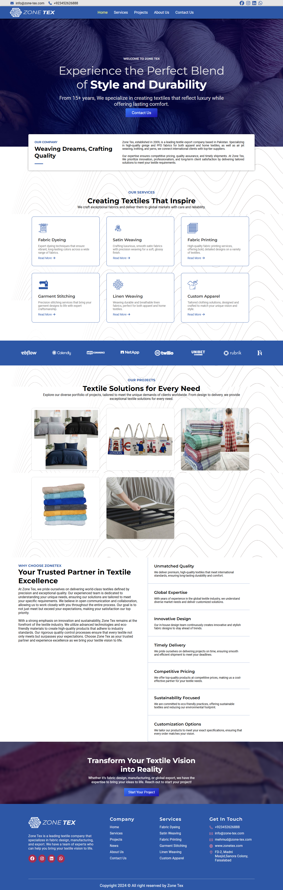
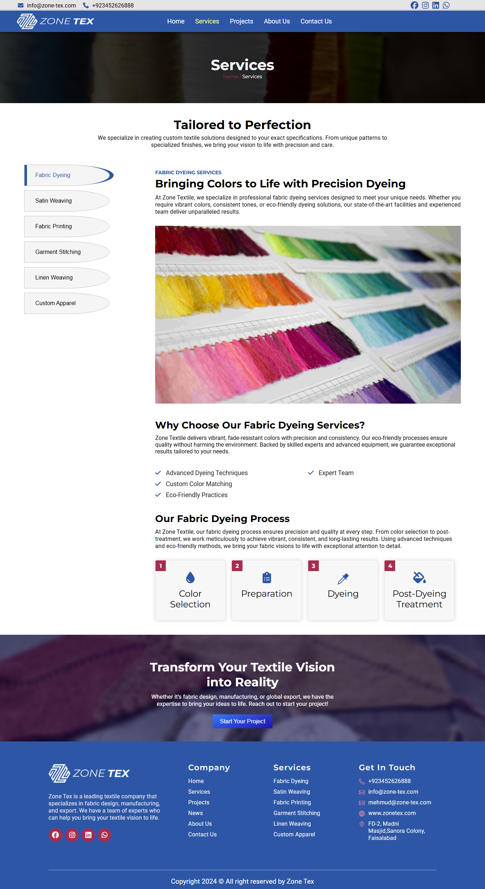
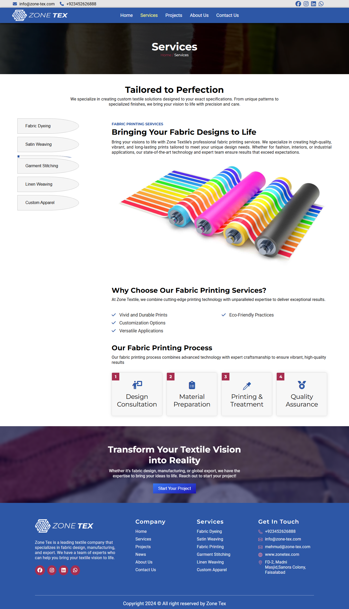
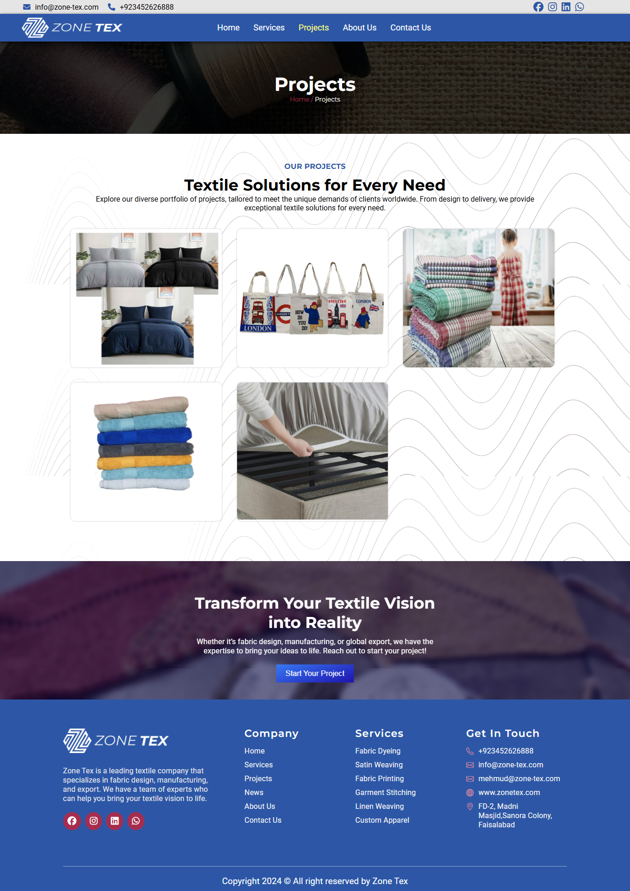
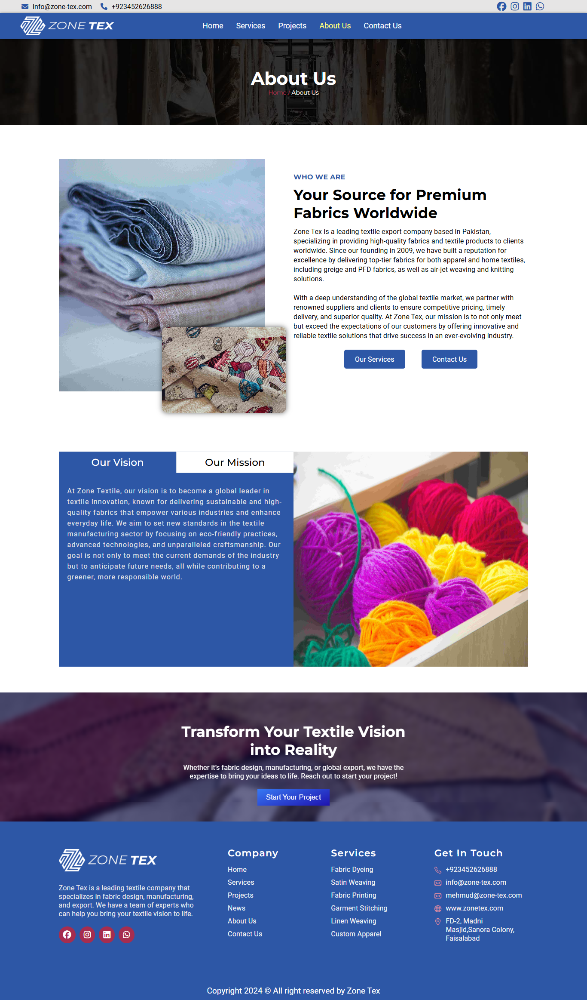
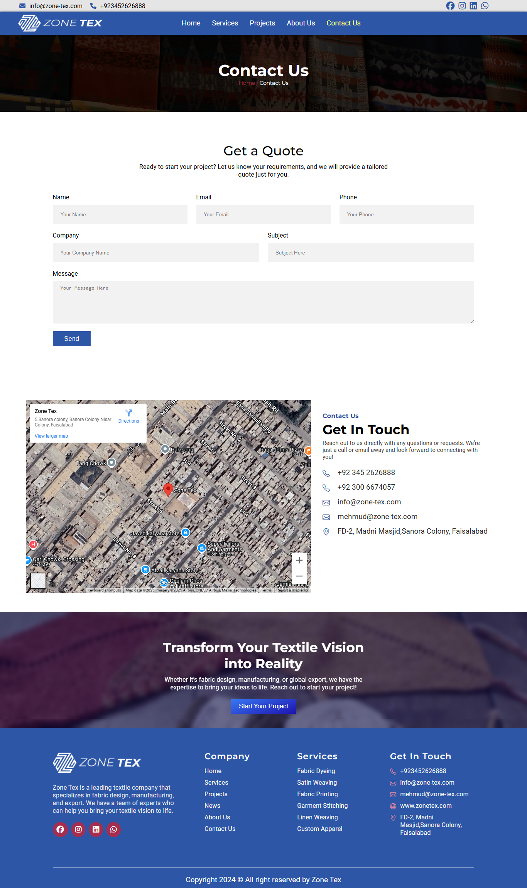

# ZoneTex - Textile Export Company Portfolio

A professional portfolio website for a textile export company built with modern web technologies.

## Technologies

- **PHP** - Server-side scripting
- **JavaScript** - Interactive functionality
- **HTML5** - Structure and markup
- **CSS3** - Styling and responsive design

## Features

### Pages
- **Home** - Company introduction and overview
- **Services** - Textile export services offered
- **Projects** - Portfolio of completed projects
- **About** - Company history and mission
- **Contact Us** - Contact information and inquiry form

### Design
- Responsive web design
- Professional textile industry styling
- Interactive user interface
- Cross-browser compatibility

## Screenshots

### Home Page

### Services Page

### Projects Page

### About Page

### Contact Page

## Purpose

This website serves as a digital portfolio and business presence for ZoneTex, showcasing their textile export capabilities, completed projects, and providing a professional platform for client engagement in the textile industry.